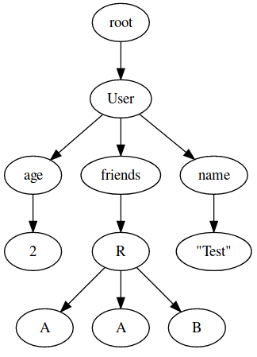

Generic Graphviz
====

consists of 3 parts (which probably should be seperate modules..):

1. Dot-Lang typed representation and Dot-Lang code-generator (located in Data.DotLang)
2. Generic Graph generator (takes an arbituary ADT and generates a graph for it)
3. Bindings for Graphviz using [viz.js](https://github.com/mdaines/viz.js/)

Example
---

```purescript
-- your data type
data Tree' a = Leaf' | Node' (Tree' a) a (Tree' a)

-- derive generic
derive instance treeGeneric :: Generic (Tree' a) _

-- create instances for the needed type classes
instance treeEdges :: Edges a => Edges (Tree' a) where edges x = genericEdges x
instance treeDotRepr ::  Edges a => GraphRepr (Tree' a) where toGraph = genericToGraph

example :: String
example = renderToSvg Dot $ toGraph $
  Node' Leaf' 3 (Node' (Node' Leaf' 5 Leaf') 4 Leaf')
-- example = "...<svg><g>...</g>...</svg>..."
```



see [full file](./test/Example.purs) for imports

TODOs
-----

- Refactor into multiple libraries
- support entine DOT language in data model
- allow custom edges in GenericGraph
