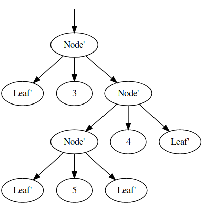

Generic Graphviz
====

consists of 3 parts (which probably should be seperate modules..):

1. Dot-Lang typed representation and Dot-Lang code-generator (located in Data.DotLang)
2. Generic Graph generator (takes an arbituary ADT and generates a graph for it)
3. Bindings for Graphviz using [viz.js](https://github.com/mdaines/viz.js/)

Example
---

```purescript

newtype User = User {name :: String, age :: Int, friends :: Test}

derive instance genericUser :: Generic User _

instance egdeUser :: Edges User where
  edges = genericEdges

instance graphReprUser :: GraphRepr User where
  toDot = genericToDot

generateSvg :: ∀a. GraphRepr a => a -> String
generateSvg e = renderToSvg Dot e

example = generateSvg (User {name: "Test", age: 2, friends: R A A B})
```


